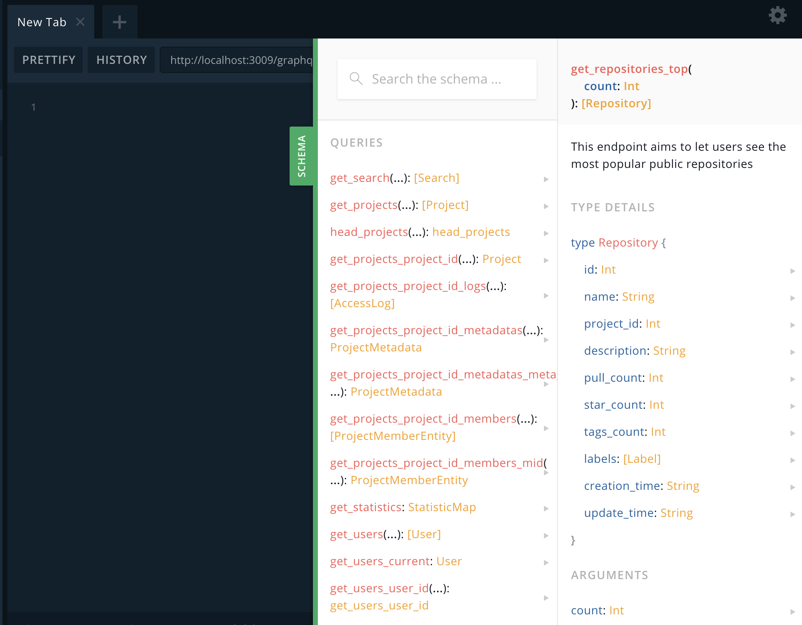

# harbor api 2 graphql api

use swagger-to-graphql  

[swagger-to-graphql](https://github.com/yarax/swagger-to-graphql)

## How to Run(local)

* install deps

```code
yarn
```

* run

```code
yarn start
```

## Run with docker && docker-compose

* local build(docker-compose)

```code
docker-compose  up -d

open http://hostip:3009/graphql for search
```

* access

```code

open http://hostip:3009/graphql for search
```

## some images


